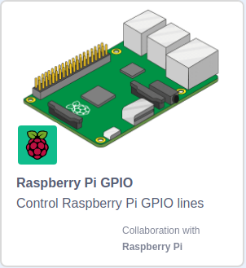

## PIR Motion sensors

A passive infrared (PIR) motion sensor is a component that you can use to detect when a warm body (like a human or an animal) is moving. You can read more about PIR motion sensors in the section below.

[[[rpi-theory-pir]]]

You might need to tune your PIR sensor so that it will work with this project.

[[[generic-electronics-tune-pir]]]

--- task ---
Now you need to connect your PIR sensor to your Raspberry Pi. Read the section below, and connect your sensor so that the **OUT** pin is connected to the **GPIO 4** pin of your Pi. **Look at the labels on the sensor to check which pin is which. You may have to lift off the cap to see the labels**


--- /task ---

You will need to test that your Raspberry Pi is able to listen to the PIR motion sensor, so that it can find out when motion is detected.

--- task ---
Open Scratch 3 from the application menu.

--- /task ---

--- task ---
Now add the Raspberry Pi GPIO extension


--- /task ---

--- task ---
You can use this script to test if your motion sensor is working

```blocks3
when flag clicked
set gpio (4 v) to input [pulled low] ::extension

when gpio (4 v) is [high v] ::hat extension
say [you moved]

when gpio (4 v) is [low v] ::hat extension
say [you're still]
```
--- /task ---

--- task ---
Cover your motion sensor with an upturned cup, then run the script by clicking on the green flag.

When you move the cup, the sprite should say `you're still`.
--- /task ---
