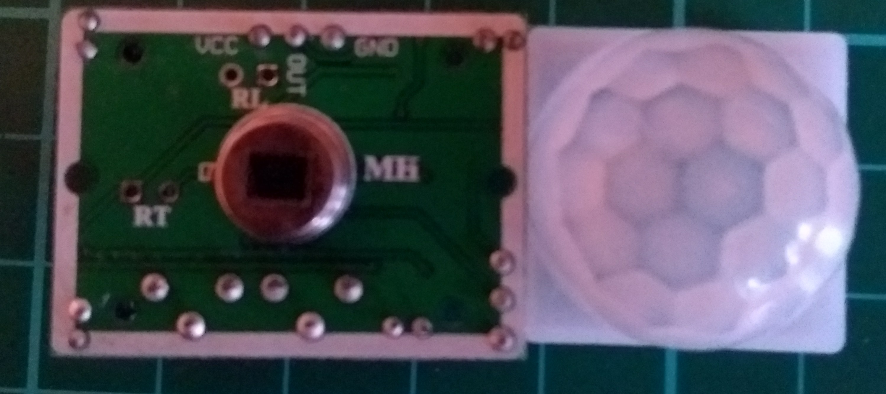
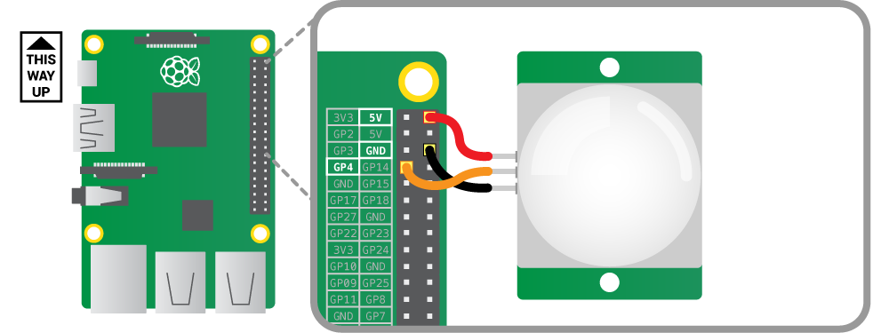

## PIR motion sensors

A passive infrared (PIR) motion sensor is a component that you can use to detect when a warm body (like a human or an animal) is moving. You can read more about PIR motion sensors in the section below.

[[[rpi-theory-pir]]]

You might need to tune your PIR sensor so that it will work with this project.

- Have a look at the section below to learn how to tune your PIR sensor correctly.

[[[generic-electronics-tune-pir]]]

- You will want to turn both potentiometers fully anti-clockwise for this project.

- Now you need to connect your PIR sensor to your Raspberry Pi. Read the section below, and connect your sensor so that the **OUT** pin is connected to the **GPIO 4** pin of your Pi. **Look at the labels on the sensor to check which pin is which. You may have to lift off the cap to see the labels**

[[[rpi-gpio-connect-pir]]]

