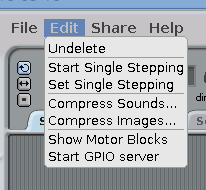
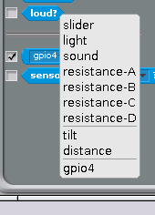

## Test the sensor

Because we are using the GPIO pins, we need to start the GPIO server in Scratch: 

- On the desktop run Scratch using `Menu -> Programming -> Scratch`.
- Once Scratch is running choose `Start GPIO Server` from the `Edit` menu.

Scratch uses the 'Sensing' blocks to check if there is any input on the GPIO pins. If there is an input, the value of the pin changes from `0` to `1`. As you connected the PIR sensor to GPIO pin 4 of the Pi, we need to monitor that. 

Firstly we need to tell Scratch that pin 4 will be used as an input by *config*uring it. 

- Create a broadcast message as follows:

- Double click the broadcast block to run it. You only need to do this once.

- In the `Sensing` block palette click on the drop-down menu on the `sensor value` block and choose `gpio4`.
- Tick the check-box to the left of the block to display the pin value on screen.

**NOTE**: If you do not see  `gpio4` on the list, make sure that the **GPIO server is running** and that you have **run the config broadcast**.

Test the PIR sensor by waving your hand in front of it. When it detects movement, the value on the screen should change from `0` to `1`.

If the value doesn't change, check that the correct pins are connected.

