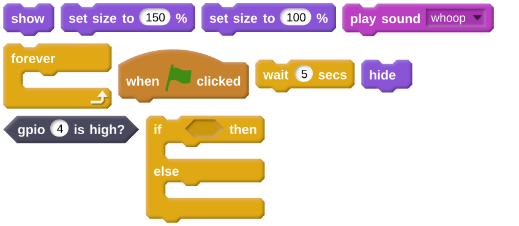
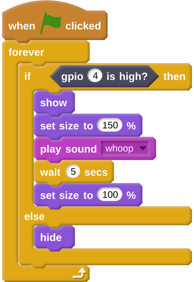

## Detecting Santa

Now that you have tested the motion sensor and created your Santa sprite, you're ready to write your program.
{:class="blockdata"}
Here is the basic idea of your algorithm:
  1. When the flag is clicked
  1. `forever`{:class="blockcontrol"}
  1. Check to see if **GPIO 4** is `high`
  1. If it is:
    - Show your sprite
	- Set its size to fill the screen
	- Play a loud noise
	- Wait for the duration of the sound
	- Reduce its size back to normal
  1. If it isn't:
    - Hide the sprite
	
- Create this algorithm in Scratch. If you don't know how to use sounds in Scratch, then have a look at the section below. If you get really stuck, you can use the hints.

[[[generic-scratch-sound-from-library]]]

--- hints --- --- hint ---
All your code will need to be place within a `forever`{:class="blockcontrol"} loop. You can then use an `if <  > then else`{:class="blockcontrol"} block to check if the pin is `high` or `low`, and carry out the actions.
--- /hint --- --- hint ---
Here are all the blocks you need to use:

--- /hint --- --- hint ---
Here's what your finished script should look like:

--- /hint --- --- /hints ---
