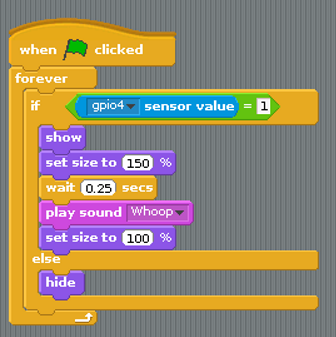

## Program what happens when the detector spots movement

Now we have a sensor that reports when it is on or off, we can use this value to control the flow of our program.  

Build the following script:

### What is the the program doing?

The `if` statement continuously checks the pin 4 sensor value. When this changes to `1` it does the following:

- shows the sprite
- makes the sprite bigger
- waits a bit
- plays a sound
- makes the sprite normal size

It keeps doing this as long as the sensor value is `1` i.e. when the PIR detects movement.

The `else` statement simply hides the sprite when the sensor value is 0.

