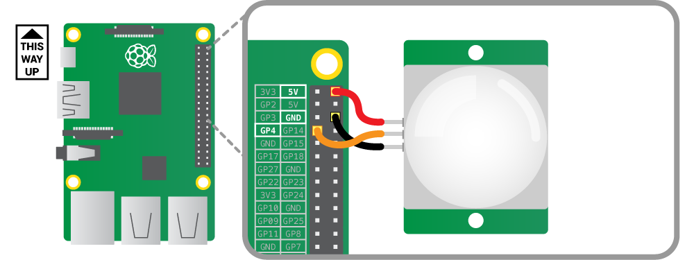
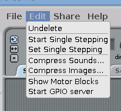
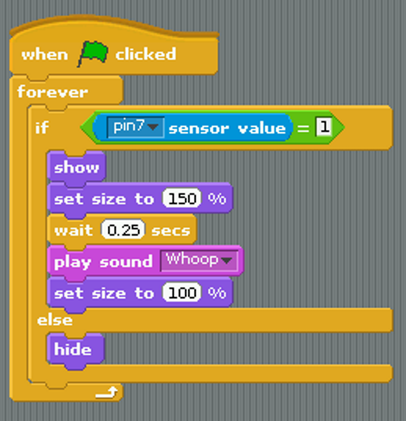
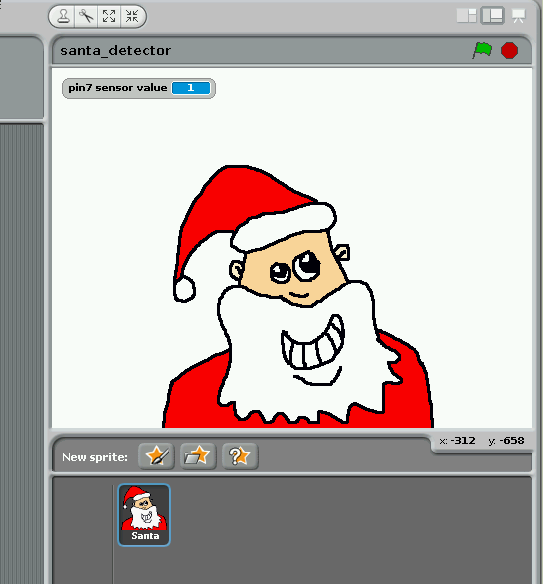

# Santa Detector

You will build a detector that spots any movement and sets off an alarm. Along the way, you will learn how to connect a passive infra-red (PIR) sensor to the Raspberry Pi, and how to control the flow of your Scratch program by responding to the input from the sensor. 

## Connect the PIR motion sensor

Before booting your Raspberry Pi, connect the PIR module to the Raspberry Pi.

Using three female-to-female jumper cables, you'll need to connect each of the PIR sensor's connectors to the appropriate pins on the Raspberry Pi.

Connect the top one labelled `VCC` on the PIR sensor to the 5V pin on the Raspberry Pi, connect the middle one labelled `OUT` to GPIO pin 4, and connect the bottom one labelled `GND` to a ground pin also marked `GND`. All shown in the following diagram:

## Test the sensor

Because we are using the GPIO pins, we need to start the GPIO server in Scratch: 

- On the desktop run Scratch using `Menu -> Programming -> Scratch`.
- Once Scratch is running choose `Start GPIO Server` from the `Edit` menu.

Scratch uses the 'Sensing' blocks to check if there is any input on the GPIO pins. If there is an input, the value of the pin changes from `0` to `1`. As you connected the PIR sensor to GPIO pin 4 of the Pi, we need to monitor that. 

Firstly we need to tell Scratch that pin 4 will be used as an input by *config*uring it. 

- Create a broadcast message as follows:

- Double click the broadcast block to run it. You only need to do this once.

- In the `Sensing` block palette click on the drop-down menu on the `sensor value` block and choose `gpio4`.
- Tick the check-box to the left of the block to display the pin value on screen.

**NOTE**: If you do not see  `gpio4` on the list, make sure that the **GPIO server is running** and that you have **run the config broadcast**.

Test the PIR sensor by waving your hand in front of it. When it detects movement, the value on the screen should change from `0` to `1`.

If the value doesn't change, check that the correct pins are connected.

## Draw a sprite and add sound

Click on the 'Costumes' tab and draw a Santa sprite. This will be displayed when the PIR senses movement.

Click on the 'Sounds' tab and import a sound from the 'Electronic' folder. I've used a siren called 'Whoop' here.

## Program what happens when the detector spots movement

Now we have a sensor that reports when it is on or off, we can use this value to control the flow of our program.  

Build the following script:

### What is the the program doing?

The `if` statement continuously checks the pin 4 sensor value. When this changes to `1` it does the following:

- shows the sprite
- makes the sprite bigger
- waits a bit
- plays a sound
- makes the sprite normal size

It keeps doing this as long as the sensor value is `1` i.e. when the PIR detects movement.

The `else` statement simply hides the sprite when the sensor value is 0.

## Set up the detector in your room!

- On Christmas Eve, set up your Pi with the sensor pointing at your bedroom door.
- Connect your Pi to a huge speaker.
- Make sure the sensor does not detect you in bed or you will get false positives; the alarm will go off every time you move!
- Go to sleep.
- Wake up when Santa comes in and feed him mince pies and sherry.

**Disclaimer:** we cannot guarantee that this alarm will not scare Santa off so that you get no presents at all, not even a wrinkled satsuma in an old sock.

## What next?

Other stuff to try:

- Make the background flash 
- Animate the sprite using costumes
- Change the sound ('Santa Claus is coming to town' would be good!) 
- Use different graphic effects instead of `change size`
- Display a message 
- Build a support or stand for the PIR module
